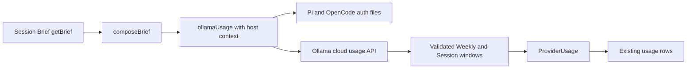

# Plan: Restore Ollama Cloud usage in Session Brief

- **Issue:** Session Brief shows no usage for Ollama Cloud while signed in.
- **Approved approach:** Host-aware OpenCode API-key adapter, minimal supported approach.
- **Planning baseline:** `824d5438eba6a0e04c91b6ef7b35a6ac935913c5`
- **Source of truth:** `issue.md` with `Judge Decision: Status: SELECTED`.
- **Implementation boundary:** Server data path only. The existing usage rows and percentage treatment are the rendering target.

## Executive Summary

### What's broken?

The Ollama adapter only probes the local daemon, never reads the signed-in OpenCode Ollama Cloud credential, and always returns zero usage windows.

### What's the fix?

Pass the existing BB host context into the Ollama adapter, select the read-only `ollama-cloud` API key from Pi/OpenCode auth data, request `https://ollama.com/api/usage`, and map validated weekly/session fractions into the existing `ProviderUsage` contract.

### What happens after the fix?

- A signed-in Ollama Cloud user sees Weekly and Session values in the current Session Brief usage rows.
- A signed-out or invalid-credential user sees a readable unauthenticated message with no numeric values.
- Malformed, unavailable, or timed-out upstream data remains safe: no fabricated windows and no RPC crash.

### What's the risk?

The upstream quota payload is not publicly specified and the auth value is sensitive. The implementation must parse `unknown` defensively, clamp percentages, return only the shared usage contract, never log or persist the key, and use cached values only for valid successful windows and transient failures.

### What's on the implementer?

Modify only the server adapter/auth wiring and focused regression oracle described below. Run the named Mechanical commands, then hand the exact post-change candidate to an independent verification pass for the signed-in Session Brief smoke. Do not commit, publish, or change UI files.

## Behavioral Contract

### Acceptance Criteria

Carry forward from `issue.md` unchanged:

- [ ] **AC1** A signed-in Ollama Cloud user who uses an Ollama Cloud model sees Weekly and Session usage in the existing usage-row and percentage treatment.
- [ ] **AC2** A signed-out user or a user with invalid Ollama Cloud credentials sees a clear unauthenticated message.
- [ ] **AC3** The signed-out or invalid-credential state shows no fabricated usage values and does not crash.
- [ ] **AC4** UI appearance changes, browser-cookie reading or scraping, token storage or refresh, and support for other providers remain out of scope.

### User Story

As a user signed in to Ollama Cloud, I want Session Brief to show my current Weekly and Session usage so that the existing Usage section reflects the provider account I am using.

### Gherkin Scenarios

#### Happy path: Signed-in Ollama Cloud usage is displayed

```gherkin
Given the user is signed in to Ollama Cloud and is using an Ollama Cloud model
When the user opens Session Brief Usage
Then the user sees Weekly and Session usage in the existing usage-row and percentage treatment instead of the truncated no-data message
```

Acceptance Criteria References:

- AC1

#### Edge path: Unauthenticated Ollama Cloud state is clear and safe

```gherkin
Given the user is signed out of Ollama Cloud or has invalid Ollama Cloud credentials
When the user opens Session Brief Usage
Then the user sees a clear unauthenticated message, no fabricated usage values, and no crash
```

Acceptance Criteria References:

- AC2
- AC3

## Scope & Boundaries

### In Scope

- Pass the existing `bb` and `hostId` from `server/composeBrief.ts` to `ollamaUsage`.
- Reuse `server/authFiles.ts` host-aware read-only auth loading and add a narrowly scoped selector for the `ollama-cloud` entry with `type: "api"` and a non-empty `key`.
- Request `GET https://ollama.com/api/usage` with JSON `Accept`, Bearer authorization, `redirect: "error"`, and the existing short timeout.
- Parse `limits.weekly.usage` and `limits.session.usage` as finite fraction-like values, convert them to 0–100, clamp them, and label the windows `Weekly` and `Session`.
- Use `resetsAt: null` for the observed response shape; preserve a reset only if a later upstream value is explicitly validated as a string.
- Reuse `server/usageCache.ts` for successful-window TTL and transient backoff.
- Add only focused parser/auth/request/cache-error regression coverage that acts as the smallest oracle for the changed server behavior.

### Out of Scope

- `components/session-brief/sections/UsageSection.tsx`, `components/session-brief/SessionBriefCard.tsx`, styling, or any other UI/display-component change.
- Browser-cookie reading or scraping, including `ollama.com/settings`.
- Token storage, persistence, copying, logging, refresh, or use of OAuth refresh fields.
- Changes to the `ProviderUsage` contract, RPC shape, or other provider adapters.
- A new meter component, literal progress-bar implementation, new dependency, commit, push, PR, merge, or publication.

## Current vs Target State

| Area | Current | Target |
| --- | --- | --- |
| Credential source | No cloud credential lookup | Read-only Pi/OpenCode host auth lookup for `ollama-cloud` API `key` |
| Upstream request | `POST http://127.0.0.1:11434/api/me` | Authenticated `GET https://ollama.com/api/usage` |
| Parsed result | Always empty windows and a no-API message | Validated `Weekly` and `Session` `UsageWindow` values |
| Unauthenticated state | Generic `ok` result with no windows | `unauthenticated`, readable message, empty windows |
| Failure state | Exceptions and malformed data collapse to the old message | Empty safe result or existing valid cache; never fabricated values |
| UI | Existing usage rows consume `ProviderUsage.windows` | Unchanged; supplied windows render through the same rows |

## Codebase Orientation

- **RPC entry:** `server.ts:108-117` calls `composeBrief` for `getBrief`.
- **Provider dispatch:** `server/composeBrief.ts:275-354` classifies the model and currently calls `ollamaUsage` without `bb` or `hostId`; `composeBrief.ts:389-393` already has both values.
- **Current defect:** `server/usageOllama.ts:25-65` only probes the local daemon and always returns `windows: []`.
- **Auth pattern:** `server/authFiles.ts:45-75` resolves the host home, reads Pi/OpenCode JSON through `bb.sdk.files.read`, decodes base64, and suppresses read/parse failures. `pickNamedOauthAccess` is the nearby selector pattern, but Ollama requires an API `key`, not OAuth `access`.
- **Parser pattern:** `server/usageAnthropicParse.ts` and `server/usageChatgptParse.ts` validate `unknown`, clamp percentages, and preserve only validated reset strings.
- **Request/cache pattern:** `server/usageChatgpt.ts:15-100` shows bounded GET/Bearer/error handling; `server/usageCache.ts:3-59` supplies successful-window TTL and backoff.
- **Consumer:** `components/session-brief/sections/UsageSection.tsx:20-66` already renders every supplied window and uses the provider message when no windows exist. It must remain unchanged.
- **Test conventions:** `node:test` and `assert/strict`; see `server/usageChatgpt.test.ts` and `server/grokAuth.test.ts`.

## Dependencies and Data Flow

No new package dependency or schema change is required. The implementation uses the existing BB plugin API, global `fetch`, `AbortSignal.timeout`, auth-file helper, cache helper, and `ProviderUsage`/`UsageWindow` types.



`ProviderUsage` and `UsageWindow` remain the data models. The parser must not pass upstream objects, credentials, identity fields, or unvalidated numbers across the RPC boundary.

## Deliverables

Future implementation should produce only these code/test changes:

1. `server/composeBrief.ts`: pass `bb` and `hostId` into `ollamaUsage`.
2. `server/authFiles.ts`: add a narrowly scoped named API-key selector. Return only the in-process key needed for the request and no unrelated fields.
3. `server/usageOllama.ts`: replace the local-daemon path with auth lookup, hosted request, cache/backoff handling, status mapping, and safe result construction.
4. `server/usageOllamaParse.ts`: keep the pure Ollama payload-to-window parser isolated for the smallest parser oracle.
5. `server/usageOllama.test.ts`: add focused parser, auth, request, cache, and error regression coverage. Do not add a broad suite or duplicate UI tests.

## Error Handling and Risks

1. **Missing auth or rejected credentials**
   - **Handling:** Return `status: "unauthenticated"`, a readable sign-in message, and `windows: []`; do not return cached numbers for missing auth or HTTP 401/403.
   - **User impact:** The Usage section shows the message and no numeric values.

2. **Malformed JSON or invalid nested usage fields**
   - **Handling:** Parser returns no fabricated windows; use an existing valid cached result only where the failure is transient and the cache is valid.
   - **User impact:** The user sees a safe empty/message state rather than incorrect percentages or a crash.

3. **Timeout, network failure, 5xx, or redirect**
   - **Handling:** Catch the failure, mark the provider backoff, and return a valid cache or safe empty `ok` result without throwing through `getBrief`.
   - **User impact:** The panel remains usable and does not display invented usage.

4. **Credential or identity leakage**
   - **Handling:** Select only the `ollama-cloud` API `key` for the one in-process Authorization header. Never log, persist, return, test-assert as output, refresh, or copy the key; never include email, refresh, OAuth, or unrelated auth fields in the result.
   - **User impact:** No credential or private identity data appears in Session Brief or diagnostics.

5. **Upstream fraction outside the expected range**
   - **Handling:** Accept only finite numeric `usage` values, convert fraction × 100, and clamp to 0–100. Missing/non-record/non-numeric values produce no window.
   - **User impact:** Existing rows receive only schema-safe percentages.

## Implementation Checklist

### Phase 1: Server adapter and smallest regression oracle

- [ ] **UPDATE:** Change `server/composeBrief.ts` so the Ollama branch passes the already available `bb` and `hostId`, without changing model classification or other provider branches.
- [ ] **ADD:** In `server/authFiles.ts`, implement a named API-key selector that scans the loaded Pi/OpenCode bags in existing order, accepts only the `ollama-cloud` entry with `type: "api"` and a non-empty string `key`, and exposes no unrelated fields.
- [ ] **ADD:** Create `server/usageOllamaParse.ts` with a pure parser that reads only `limits.weekly.usage` and `limits.session.usage`, emits `Weekly` then `Session` when each value is valid, converts fractions to clamped percentages, and sets absent/invalid reset values to `null`.
- [ ] **UPDATE:** Replace the local-daemon request in `server/usageOllama.ts` with the host-aware flow: check missing auth before serving cache, reuse valid cache/backoff, make the hosted GET with the required headers/options, map 401/403 to unauthenticated empty usage, and map transient/unavailable responses to cached or safe empty usage.
- [ ] **UPDATE:** Keep all successful-window caching keyed by the existing provider identity and call `rememberUsage` only when the parser produced validated windows; never cache an empty or unauthenticated result as usage.
- [ ] **ADD:** Create `server/usageOllama.test.ts` using existing `node:test` conventions as the smallest oracle:
  - [ ] **TEST:** Verify weekly/session fraction mapping, 0→0, 1→100, low/high clamping, `resetsAt: null`, and no windows for missing, non-record, non-numeric, or malformed nested fields.
  - [ ] **TEST:** Verify only an `ollama-cloud` API `key` is selected, OAuth/refresh/email/unrelated fields do not reach the result, and the request is a hosted GET with JSON `Accept` and Bearer auth.
  - [ ] **TEST:** Verify missing credentials and 401/403 return unauthenticated empty usage; timeout/5xx/malformed responses do not throw or fabricate values.
  - [ ] **TEST:** Verify valid windows are reused within the existing TTL and transient backoff prevents a request storm.
- [ ] **VERIFY:** Run the initial Build Mechanical commands from the repository root: `npm run typecheck && npm test`; expect exit 0 and the focused Ollama oracle to pass.

### Phase 2: Independent verification gate

- [ ] **VERIFY:** Obtain a separate `code-quality-gate` review before any authorized commit; confirm the diff is server-only, follows existing auth/cache/parser patterns, and does not leak credentials.
- [ ] **VERIFY:** Obtain a separate `verification-gate` desktop pass on the exact post-implementation candidate. Use the real signed-in Session Brief smoke below, not logs or test output alone.

### Phase 3: Commit and publication

Not authorized by this plan. Do not commit, amend, push, open a PR, merge, or publish.

## Verification Target

- **Platform:** `desktop`
- **Objective:** A real signed-in Ollama Cloud model produces Weekly and Session values in the unchanged Session Brief Usage rows.
- **Falsifier:** The Usage section still shows the no-remaining-% message with no Weekly/Session values, or displays fabricated values, crashes, or exposes credential data.
- **Primary Flow:** On the exact post-implementation candidate descended from `824d5438eba6a0e04c91b6ef7b35a6ac935913c5`, load the plugin in the BB desktop runtime; sign in to Ollama Cloud through the normal supported flow; use a working Ollama Cloud model; open the Session Brief entry point from the thread header; expand Usage; verify the existing rows show `Weekly` and `Session` with percentage treatment. Record the exact candidate hash with the evidence. No cookie scraping or manual auth-file mutation is part of this flow.
- **Regression Check:** Repeat the same Session Brief Usage path with Ollama Cloud signed out or credentials rejected; verify a readable unauthenticated message, no numeric usage values, and no crash.
- **Mechanical:** Build owner runs `npm run typecheck && npm test` from the repository root. Expected: exit 0, typecheck passes, and the focused parser/auth/request/cache-error oracle passes. This is supporting evidence, not a substitute for the desktop smoke.
- **Observable:** Independent verification retains the user-visible result under `{ISSUE_DIR}/verification/screenshots/`, for example `ollama-signed-in-usage.png` and `ollama-unauthenticated.png`; screenshots must show the app-owned Usage panel, not a terminal or test runner.
- **Pass Criteria:** The signed-in screenshot shows Weekly and Session rows with plausible bounded percentages in the existing treatment; the regression screenshot shows only the clear unauthenticated message with no numeric values; Mechanical output is green; no crash or credential exposure is observed.
- **Blocked Conditions:** Verification is blocked if the BB desktop runtime cannot load the exact candidate, the verifier lacks a signed-in Ollama Cloud account and working Ollama Cloud model, host-aware OpenCode auth is unavailable, or network access to the hosted usage endpoint is unavailable. The maintainer/QA owner must supply the runtime/account/model and rerun the primary flow; do not substitute a mocked UI or claim the user outcome from Mechanical output.

## Unresolved Gaps

- Ollama’s public documentation does not define the observed account-quota response shape; the implementation must remain defensive and treat the sanitized observed shape as the minimum supported contract.
- The inspected response supplied no reset field, so the first implementation should use `null`; a later validated reset field must not expand scope into UI work.
- The signed-in desktop smoke requires maintainer/QA access to the real Ollama Cloud account, model, BB host, and exact post-change candidate; that access was not exercised during planning.

## Plan Judge

- Decision: `APPROVE_PLAN`
- Score: 100
- Chosen proposal: Implement the selected host-aware OpenCode API-key adapter, preserving the existing provider contract and usage-row rendering.
- Checked: `issue.md`, `plan.md`, all five `research/*.md` files, create-issue reference; ETHOS not present

### Notes

- The plan follows the explicitly selected Approach 1, preserves the stated server-only boundaries, gives concrete file-scoped tasks, and has a complete desktop Verification Target with retained app-owned screenshots.
- Both unchanged Given/When/Then scenarios are now enclosed in separate valid `gherkin` fenced blocks, satisfying the failed markdown-formatting criterion.
- The revision introduces no relevant scope or content drift; the selected proposal, boundaries, scenarios, and implementation intent remain unchanged.

### Required Changes

- None
